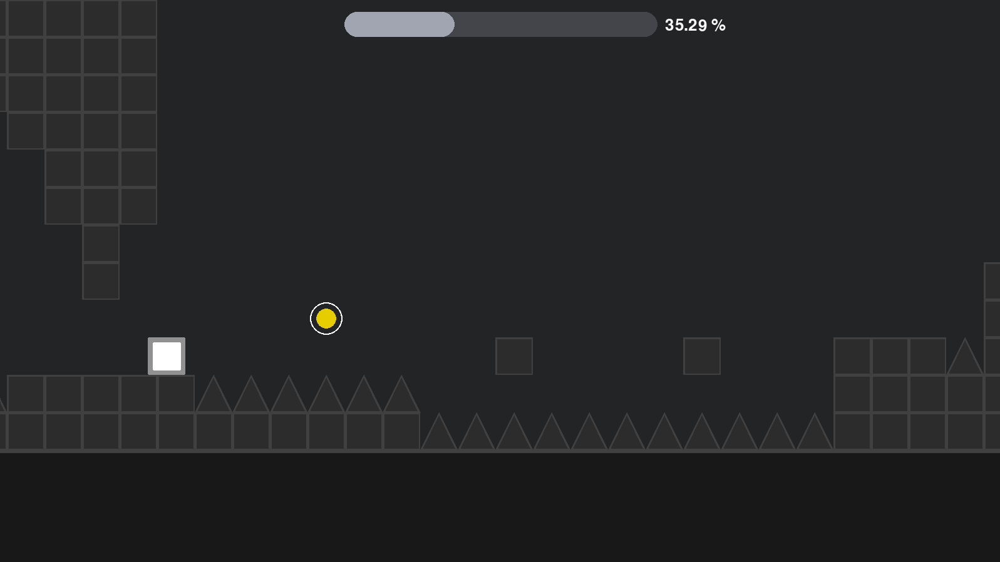
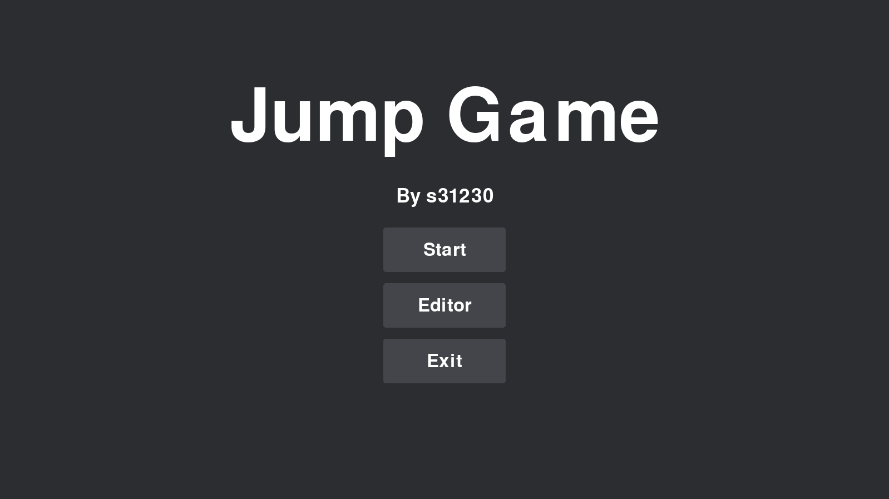
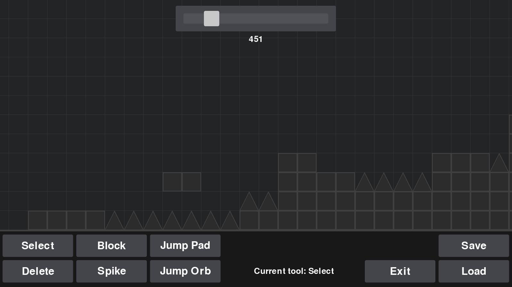
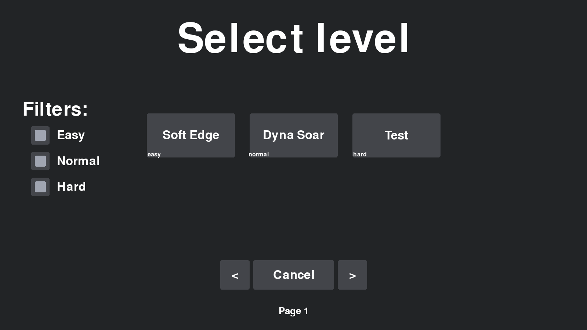
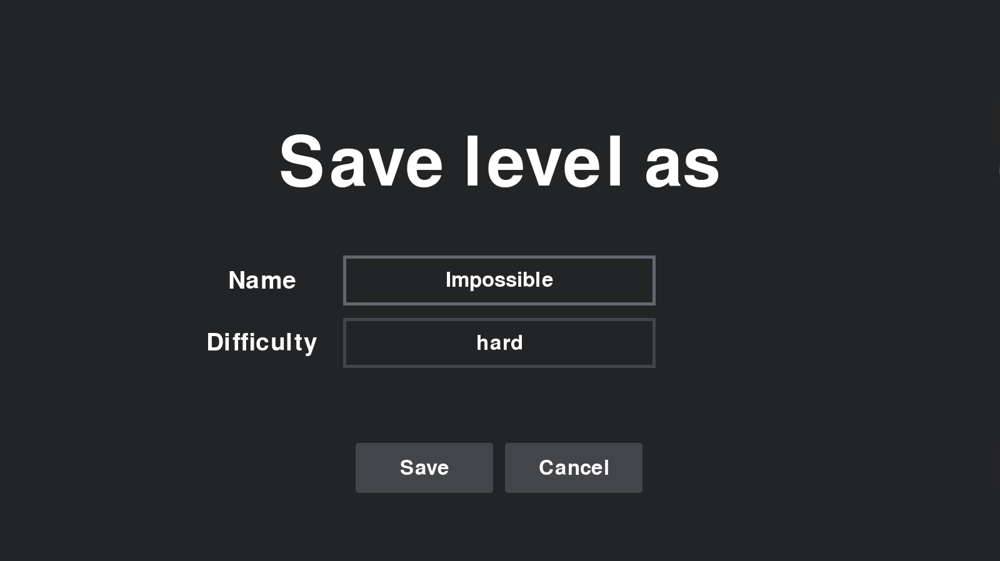

# Jump Game

A game that bears resemblence to the popular game <b>"Geometry Dash"</b>. Made entirely from scratch by using <b>pygame</b> library. Project serves as a <b>PPY</b> class final assignment at my university.



## About 
    
### How to Play
- **Left mouse click/Up Arrow**: Jump
- **Hold**: Continuous jumping
- **Escape**: Returns you to the previous window state
- Navigate through obstacles and reach the end of each level
- Avoid spikes and other hazards
- Time your jumps carefully to maintain momentum

## Features: </h4>

    - Custom Physics Engine: Built from scratch using pygame
    - Multiple Levels: Various challenging levels with increasing difficulty
    - Collision Detection: Precise collision system for blocks and spikes
    - Smooth Gameplay: Optimized performance for responsive controls
    - Asset Management: Organized sprite and sound assets
    - Level Editor: For level edition (loading and saving available)

## Project Structure

```
JumpGame/
├── .idea/          # IDE configuration files
├── assets/         # Game sprites, sounds, and other media
├── config/         # Game configuration files
├── game/           # Core game logic and mechanics
├── levels/         # Level definitions and layouts
├── objects/        # Game objects (player, obstacles, etc.)
├── ui/             # User interface components
├── main.py         # Main game entry point
├── requirements.txt # Python dependencies
└── Dockerfile      # Docker configuration
```

## Installation

### Prerequisites

- Python 3.7 or higher
- pip package manager

### Local Setup

1. **Clone the repository**
   ```bash
   git clone https://github.com/wanget5u/JumpGame.git
   cd JumpGame
   ```

2. **Install dependencies**
   ```bash
   pip install -r requirements.txt
   ```

3. **Run the game**
   ```bash
   python main.py
   ```

### Docker Setup

Alternatively, you can run the game using Docker:

1. **Build the Docker Image**
   <h6>Navigate to the root directory of your JumpGame project in your terminal (where the Dockerfile is located) and run:</h6>
   ```bash
   docker build -t jump-game .
   ```

2. **Navigate to the Project Directory in your Linux Terminal**
   <h6>It's crucial to run the game from within a WSL Linux terminal (e.g., Ubuntu, Debian) to correctly leverage WSLg. <br>
First, open your WSL terminal. Then, navigate to your project directory:</h6>
   ```bash
   cd /mnt/c/Users/{your_host_name}/Pycharm
   ```

3. **Run the Game via Docker**
   <h6>Ensure Docker Desktop is running on Windows. Then, from your WSL Linux terminal, execute the following command.<br> This command passes the necessary environment variables and mounts the X11 socket for graphical output via WSLg.</h6>
   ```bash
   sh run_docker_params.sh
   ```
   or
   ```bash
   docker run \
   -e DISPLAY=$DISPLAY \
   -e WAYLAND_DISPLAY=$WAYLAND_DISPLAY \
   -e XDG_RUNTIME_DIR=$XDG_RUNTIME_DIR \
   -v /tmp/.X11-unix:/tmp/.X11-unix \
   -v $XDG_RUNTIME_DIR:$XDG_RUNTIME_DIR \
   -it jumpgame
   ```

### WebApp Setup

You can also run the game with <b>pygbag</b> by running. Game should be available on http://localhost:8000/
```bash
  cd .
  pygbag JumpGame
```

# In-game screenshots

### Title menu:



### Level editor:



### Level loader:



### Level save:


